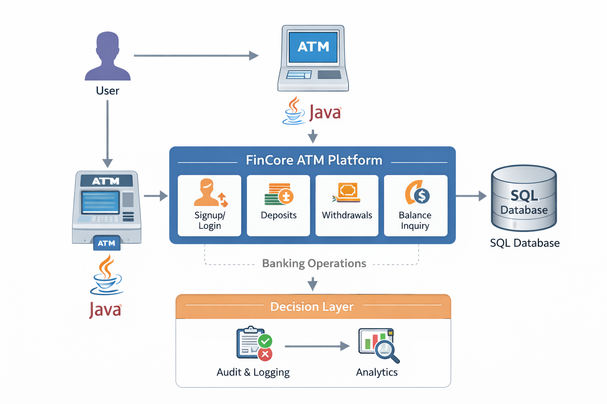

# FinCore ATM Platform

A Java-based ATM transaction engine implementing core banking operations including authentication, deposits, withdrawals, and balance management.

---

## 🧠 System Architecture

---

## 🚀 Features

- User Signup & Login
- Deposit Funds
- Withdraw Funds
- Balance Inquiry
- Fast Cash Functionality
- Transaction Processing Logic

---

## 🛠 Tech Stack

- Java (OOP)
- SQL (Data Storage)
- Basic UI with image assets

---

## 🔄 Core Flow

User → ATM Interface → Java Processing Layer → SQL Database → Response to User

---

## 📂 Project Structure

- `main_Class.java` — Entry point
- `Login.java`, `Signup*.java` — Authentication
- `Deposit.java`, `Withdrawl.java`, `BalanceEnquriy.java` — Banking Operations
- Image assets for UI

---

## 🎯 Learning Objectives

- Object-Oriented Programming
- Transaction Handling
- Basic Banking System Simulation
- Backend Logic Structuring

---

Built as a backend-focused banking transaction simulation platform.
